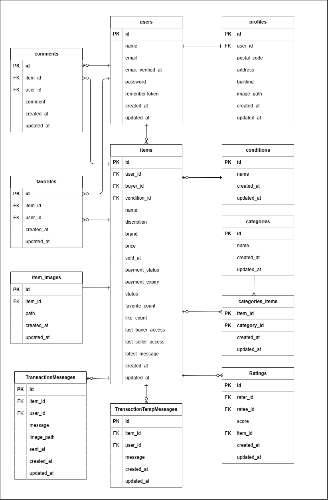

# TestFleaMarket(模擬案件フリマサイト)

## 概要
模擬案件フリマサイト

## 環境構築
**Dockerビルド**
1. `git@github.com:KOU-jpg/FleaMarketApp.git`
2. DockerDesktopアプリを立ち上げる
3. docker-compose up -d --build

**Laravel環境構築およびstripe CLI環境構築**
1. docker-compose用.「.env」を作成する
「.env.stripe.example」ファイルを 「.env」ファイルに命名を変更。または、新しく「.env」ファイルを作成

2. 公開可能キーとシークレットキーの取得  
[Stripeダッシュボード](https://dashboard.stripe.com/)にログインし、開発者」→「APIキー」から公開可能キ-を取得

3. 取得した公開可能キーとシークレットキーを、docker-compose用.「.env」とLaravel用.「.env」の2か所に記載
``` text
STRIPE_PUBLIC_KEY=pk_test_*****
STRIPE_SECRET_KEY=sk_test_*****
```
4. docker-compose exec php bash
5. composer install
6. Laravel用.「.env」を作成する  
「.env.laravel.example」ファイルを 「.env」ファイルに命名を変更。または、新しく「.env」ファイルを作成してくだい

7. 「.env」に以下の環境変数を追加
``` text
DB_CONNECTION=mysql
DB_HOST=mysql
DB_PORT=3306
DB_DATABASE=laravel_db
DB_USERNAME=laravel_user
DB_PASSWORD=laravel_pass

MAIL_MAILER=smtp
MAIL_HOST=mailhog
MAIL_PORT=1025
MAIL_USERNAME=null
MAIL_PASSWORD=null
MAIL_ENCRYPTION=null
MAIL_FROM_ADDRESS=no-reply@example.com
MAIL_FROM_NAME="【模擬案件フリマアプリ】メール認証"
```
8. 2で取得した公開可能キーとシークレットキーをLaravel用.「.env」にも記載
``` text
STRIPE_PUBLIC_KEY=pk_test_*****
STRIPE_SECRET_KEY=sk_test_*****
```

9. アプリケーションキーの作成
``` bash
php artisan key:generate
```

10. シンボリックリンク作成
``` bash
php artisan storage:link
```

11. マイグレーションの実行
``` bash
php artisan migrate
```

12. シーディングの実行
``` bash
php artisan db:seed
```

13. ディレクトリ権限の設定  
Laravelがログやキャッシュを書き込めるよう、storageとbootstrap/cacheディレクトリの権限を設定してください
``` bash
chown -R www-data:www-data storage bootstrap/cache
chmod -R 775 storage bootstrap/cache
```

14. Stripe CLIの認証（初回のみ）  
Stripe CLIを初めて利用する場合、以下のコマンドでStripeアカウントと認証します
``` bash
docker-compose exec stripe-cli stripe login
```
コマンド実行後、ペアリングコードと認証用URLが表示されます  
指示に従い、URLにアクセスしペアリングコードを入力して認証を完了してください  
認証が完了すると「Done! The Stripe CLI is configured for your account...」と表示されます

15. Webhookシークレットキーの取得
``` bash
docker-compose exec stripe-cli stripe listen --print-secret
```


16. 取得したWebhookシークレットキーを、docker-compose用.「.env」とLaravel用.「.env」の2か所に記載
``` text
STRIPE_WEBHOOK_SECRET=*****
```


## 使用技術(実行環境)
- PHP8.2-fpm
- Laravel8.83.29
- MySQL8.0.26
- Nginx 1.21.1
- phpMyAdmin（latest）
- MailHog（latest）
- Stripe CLI（latest）

## ER図


## URL
- 開発環境：http://localhost/
- phpMyAdmin:：http://localhost:8080/
- SMTPサーバー: localhost:1025
    - アプリのメール送信設定で使用
- Web UI: http://localhost:8025/
    - ブラウザでアクセスし、送信されたメールを確認
# app-laravel
# FleaMarketApp
